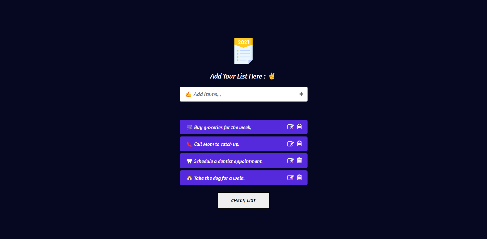

# 📝 ToDo App [[Live Preview](https://todo-app-live2.netlify.app/)]

A sleek and intuitive task management application built with React, featuring real-time updates, task filtering, and a clean user interface designed for maximum productivity.

### Application Overview


<br>

## ✨ Features

### 🎯 Core Functionality

- ➕ Quick task addition
- ✅ Task completion tracking
- 🗑️ Task deletion
- 🔍 Task filtering system
- 💾 Local storage persistence

<br>

## 🎨 User Interface

### Task Management
- Clean, minimalist design
- Intuitive input fields
- Real-time updates
- Responsive layout

### Filter System
- All tasks view
- Completed tasks
- Pending tasks
- Clear completed option

<br>

## 🚀 Getting Started

### Prerequisites

- Node.js 16.x or higher
- npm or yarn package manager

### Installation

1. Clone the repository:
   ```sh
   git clone https://github.com/VinayShetyeOfficial/react-todo-app-2.git
   ```
2. Navigate to the project directory:
   ```sh
   cd React-Todo-App-2
   ```
3. Install dependencies:
   ```sh
   npm install
   ```
4. Start the development server:
   ```sh
   npm start
   ```

<br>

## 📁 Project Structure

```
React-Todo-App-2/
│── src/
│   ├── components/
│   ├── styles/
│   ├── utils/
│   ├── App.js
│   ├── index.js
│── public/
│── package.json
└── README.md
```

<br>

## 🛠️ Future Enhancements

Planned features:

- Dark/Light theme toggle
- Task categories
- Due dates and reminders
- Task priority levels
- Data export/import
- Drag and drop reordering

<br>

## 🤝 Contributing

Contributions are welcome! Please feel free to submit a Pull Request.

1. Fork the project
2. Create your feature branch:
   ```sh
   git checkout -b feature/AmazingFeature
   ```
3. Commit your changes:
   ```sh
   git commit -m 'Add some AmazingFeature'
   ```
4. Push to the branch:
   ```sh
   git push origin feature/AmazingFeature
   ```
5. Open a Pull Request

<br>

> [!NOTE]  
> This project is developed for learning purposes and to demonstrate React fundamentals.

<br>

## 📧 Contact

Vinay Shetye - [GitHub](https://github.com/VinayShetyeOfficial) - vinay.shetye.personal@outlook.com <br>
Project Link: [https://github.com/VinayShetyeOfficial/react-todo-app-2](https://github.com/VinayShetyeOfficial/react-todo-app-2)
